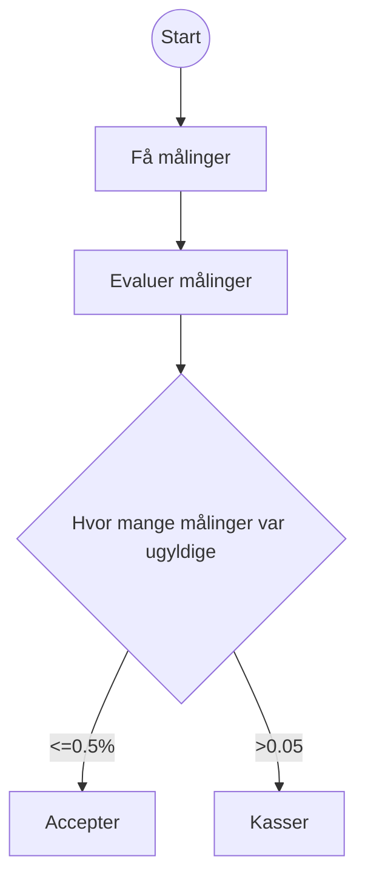
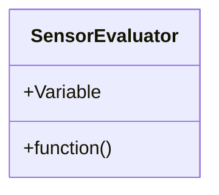

Note md filer:
Dobbel space fungerer som enter

Note flowchart:  
Rune former(()) - start/slut  
Firkantet[] - scriptet gør noget  
Diamant{}- Decision(true/false)

Hver enhed skal testes 1000 ganges (1000 samples)  
Der skal desuden testes 1000 enheder (dvs. 1,000,000 tests i alt)

Note klassediagrammer:  
+(Public) - metoden/variablen er tilgængelig overalt (andre klasser kan anvende den)

-(Privat) - metoden/variablen kan ikke anvendes af andre klasser(kun tilgængelig i sin egen klasse)

