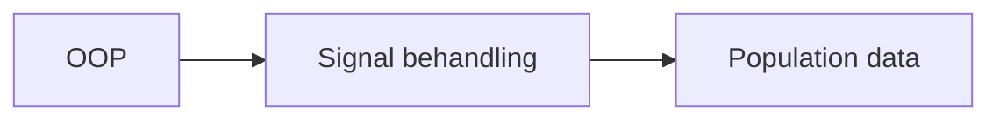
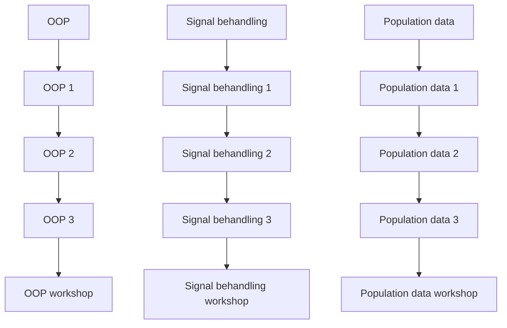

# Download mit repository
```bash
git clone https://github.com/Malik-sundxtech/AnvProg
```
Husk du skal have et activt venv for at køde koden

Se et godt eksempel på et flowchart og klassediagrammer i [her](Workshops/Workshop_2/Delopg1_workflow.md)


# Noter til mig selv
På min windows computer skal jeg for at køre jupyter notebook brugefølgende kommando:
```bash
python -m notebook
```

**Flowchart notation:** \
Cirkler = start/stop \
Rektangler = handling \
Romber = beslutninger(ja/nej)

**Class Diagram notation:** \
"+" = public \
"-" = private \
"#" = protected 



