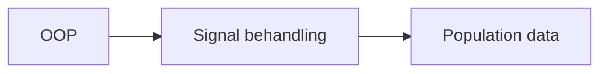
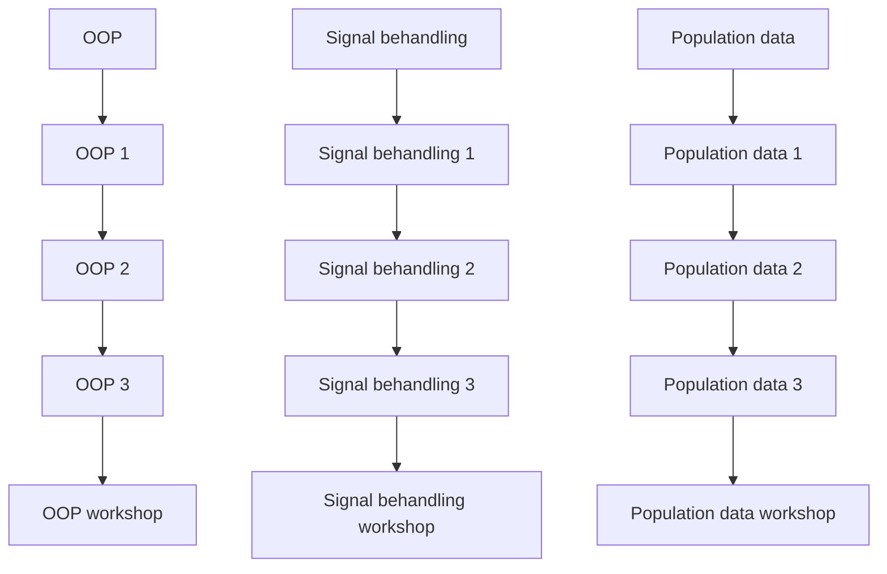

Test

```mermaid
flowchart LR

1[OOP] --> 2[Signal behandling] --> 3[Population data]

```

```mermaid
flowchart TD

1[OOP] --> 1.1[OOP 1] --> 1.2[OOP 2] --> 1.3[OOP 3] --> 1.4[OOP workshop]

2[Signal behandling] --> 2.1[Signal behandling 1] --> 2.2[Signal behandling 2] --> 2.3[Signal behandling 3] --> 2.4[Signal behandling workshop]

3[Population data] --> 3.1[Population data 1] --> 3.2[Population data 2] --> 3.3[Population data 3] --> 3.4[Population data workshop]
```