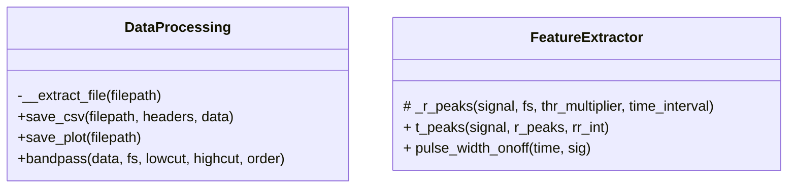

Note md filer:
Dobbel space fungerer som enter

Note flowchart:  
Runde former(()) - start/slut  
Firkantet[] - scriptet gør noget  
Diamant{}- Decision(true/false)

```mermaid
flowchart TD
S((Start))
L[Load data]
F[Filtrer støj(bandpass)]
R[Find r peaks]
T[Find t peaks]
int[Find rr og rt interval]
ppi[Find PPI]
pw[Find pulse width]
plt[Plot graferne for ECG og PPG]
sv[Gem plots og data i png og csv filer]

E((End))

s --> L --> F --> R --> T --> int --> ppi --> pw --> plt --> sv


```
Note klassediagrammer:
purblic, protected og privat påvirker noteres såldes og påvirker tilgændelighed i scriptet således:  
+(Public) - tilgængelig overalt
# (Beskyttet) - kun tilgængelig i egen klasse og subklasser(subklasse, en klasse der får værdier fra en anden klasse)
-(Privat) - Kun tilgængelig i egen klasse (andre klasser kan ikke få værdier herfra)

Note til klassediagram: der benyttes angives kun variabler hvis de gemmes i klassen fx ved:
```
self.test = test
```
Så ville man skrive +test i klassediagrammet

